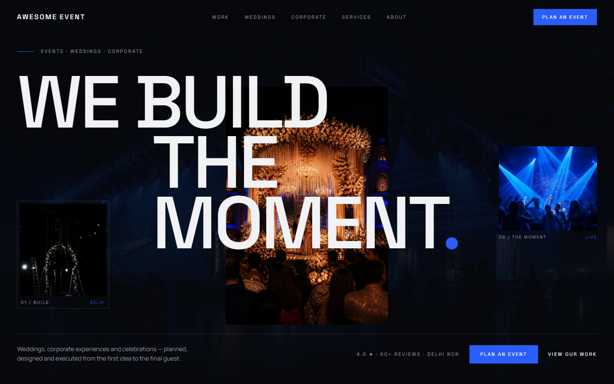
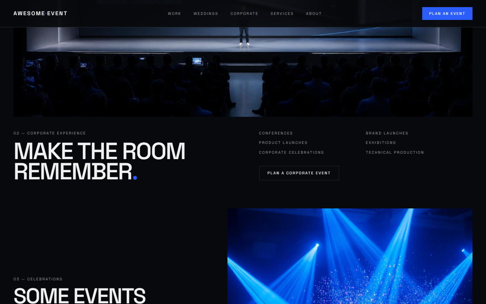
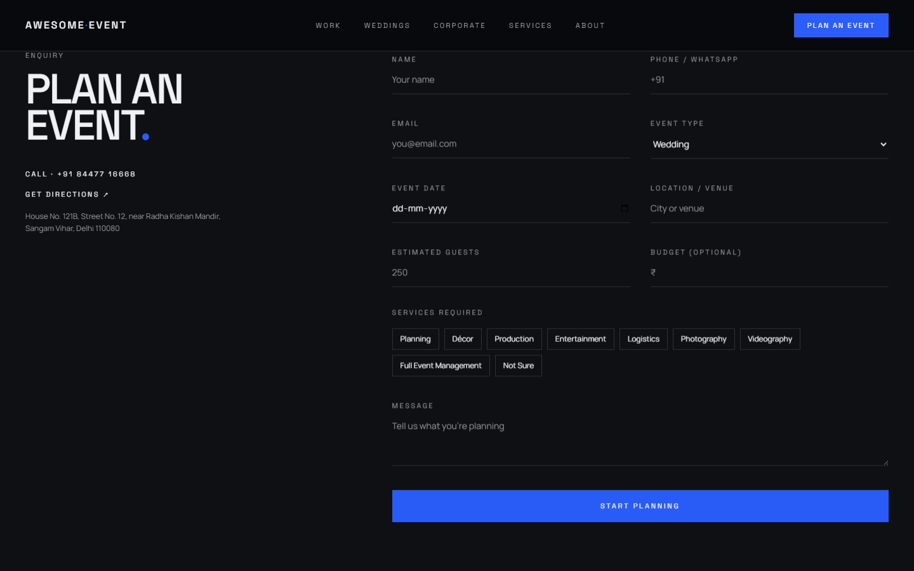
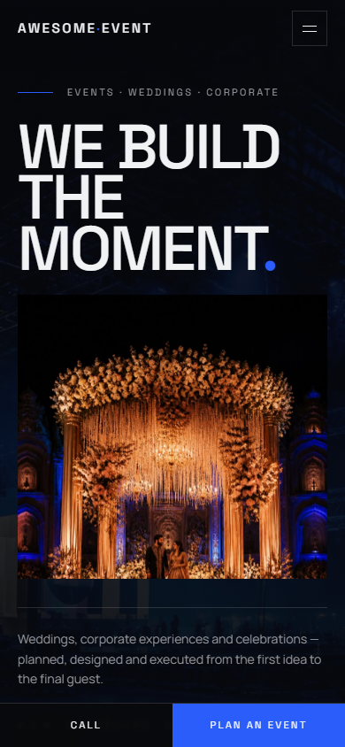

# Awesome Event

Marketing site for **Awesome Event** — wedding, corporate, and destination event planning and production in Delhi NCR.

The site is a single-page editorial experience: layered photography, large typography, and a direct enquiry path to the public business phone.



## Features

- Cinematic hero with layered event photography
- Portfolio sections for weddings, corporate, celebrations, and destination work
- Capabilities and process timeline
- Public review excerpt (Justdial, 4.9 / 5)
- Enquiry form that opens WhatsApp with a structured brief
- Click-to-call, Google Maps directions, and mobile sticky CTAs
- LocalBusiness structured data and canonical SEO metadata

## Screenshots

### Work



### Enquiry



### Mobile



## Tech stack

| Layer | Choice |
| --- | --- |
| UI | React 19 |
| Framework | TanStack Start (file-based routing, SSR) |
| Bundler | Vite 8 |
| Server | Nitro 3 |
| Styling | Tailwind CSS 4 |
| Hosting | Vercel |

No database, auth, or third-party API keys are required. Enquiry submissions open WhatsApp (`wa.me`) using the public business number.

## Architecture

```
src/
  routes/           File-based routes (__root, index)
  components/site/  Page sections (Nav, Hero, Sections)
  components/ui/    Shared UI primitives
  lib/              Contact data, media registry, SSR error helpers
  assets/           Photography used on the homepage
  start.ts          CSRF + SSR error middleware
  server.ts         Nitro server entry with HTML error fallback
public/             Favicon, robots.txt
docs/screenshots/   README captures of the live app
```

`src/routeTree.gen.ts` is generated by TanStack Router. Do not edit it by hand.

## Requirements

- Node.js 20+
- npm

## Local development

```sh
git clone https://github.com/Amaar-Ali/event-architects.git
cd event-architects
npm install
npm run dev
```

Dev server defaults to [http://localhost:3000](http://localhost:3000).

## Scripts

| Command | Purpose |
| --- | --- |
| `npm run dev` | Vite development server |
| `npm run build` | Production client + SSR + Nitro build |
| `npm run preview` | Serve the production output locally |
| `npm run lint` | ESLint |
| `npm run typecheck` | TypeScript (`tsc --noEmit`) |
| `npm run format` | Prettier |

## Environment variables

None required for build or runtime.

## Build and deploy

Production output is written to `.output/`.

```sh
npm run build
npm run preview
```

Vercel detects TanStack Start + Nitro automatically. Deploy from the project root:

```sh
npx vercel --prod --yes
```

Do not deploy a local `--prebuilt` artifact unless the Nitro preset is `vercel`. A local `vite build` uses the `node-server` preset.

## Usage

- **Plan an Event** / **Start planning** — enquiry form; submit opens WhatsApp with the brief
- **Call** — `tel:+918447716668`
- **Get directions** — Google Maps for the Sangam Vihar address
- Hash links (`#work`, `#weddings`, `#corporate`, `#capabilities`, `#about`, `#enquiry`) scroll on the homepage

## License

Private business site. All rights reserved © 2026 Awesome Event.
